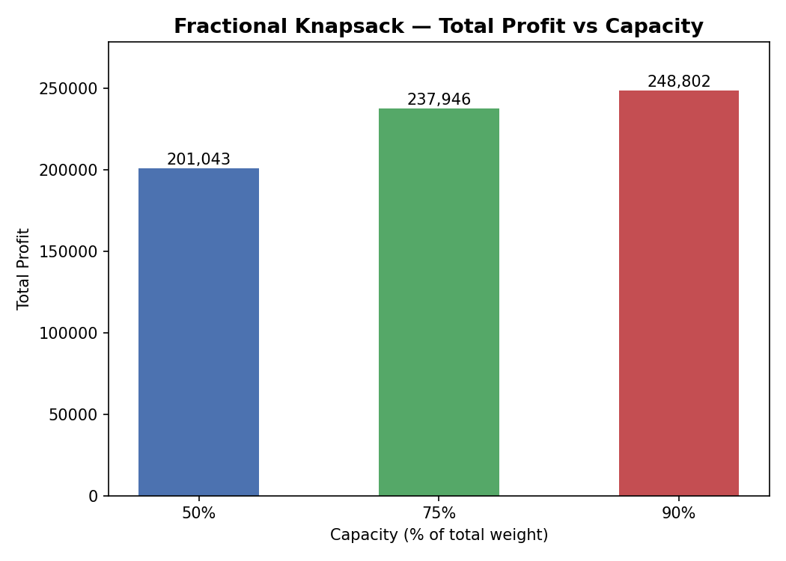
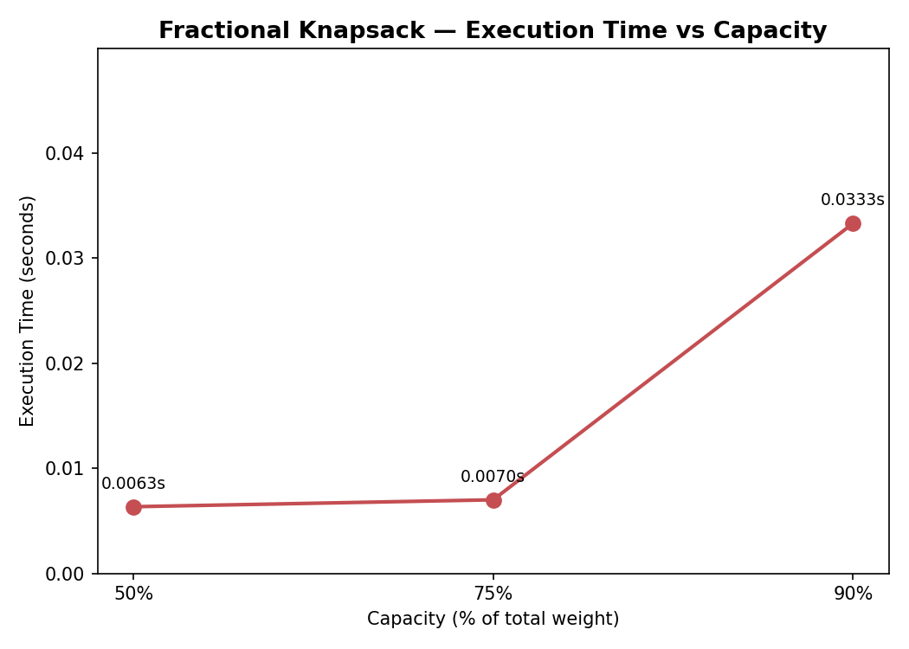
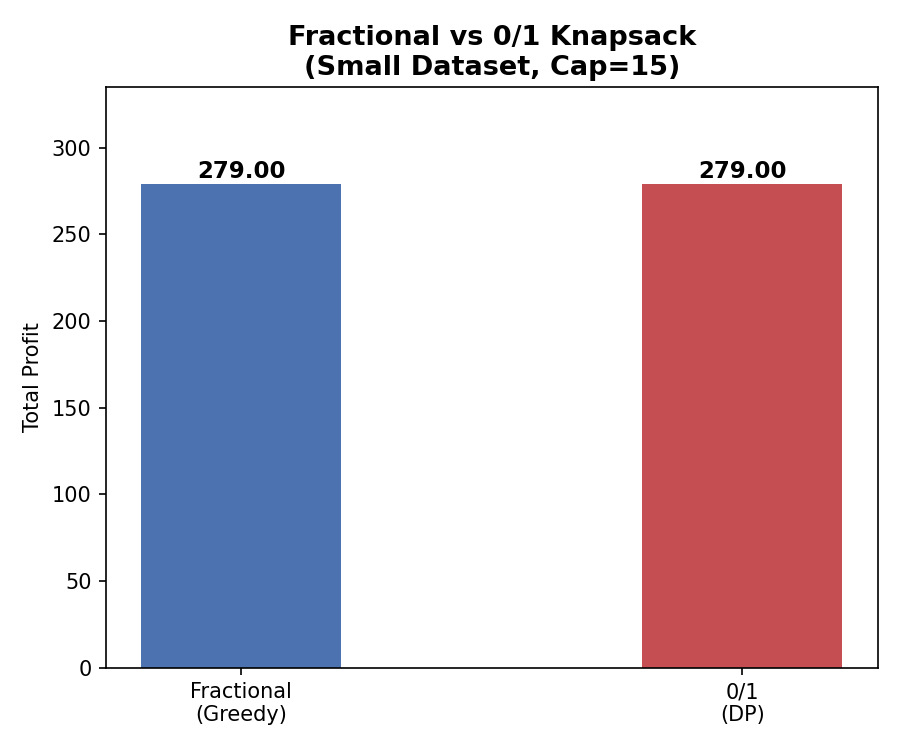
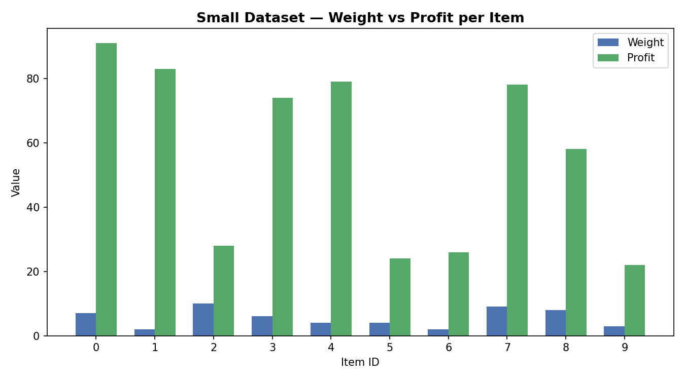
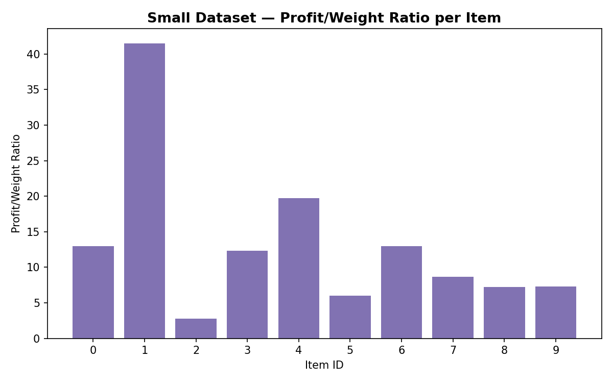
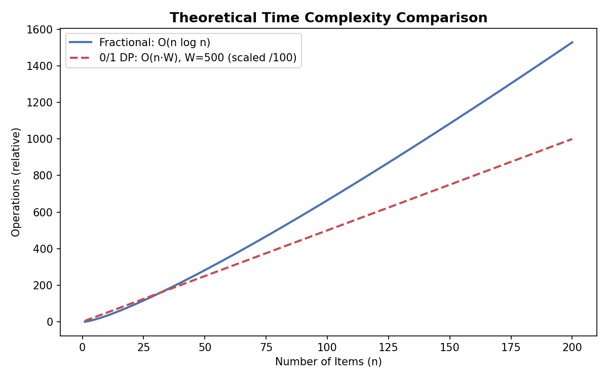

# Knapsack Optimization — Greedy & Dynamic Programming


> A Python implementation comparing two classic approaches to the Knapsack problem — **Fractional Knapsack** via a greedy algorithm and **0/1 Knapsack** via dynamic programming — with large-scale experimentation, CSV export, and automated visualizations.

---

## Overview

The **Knapsack Problem** is a fundamental combinatorial optimization problem: given a set of items each with a weight and profit, select items to maximize total profit without exceeding a weight capacity.

This project implements and compares two strategies:

| Strategy | Approach | Optimal? |
|---|---|---|
| Fractional Knapsack | Greedy (sort by ratio) | ✅ Yes — when fractions allowed |
| 0/1 Knapsack | Dynamic Programming | ✅ Yes — for integer items |

Items are represented as plain arrays `[id, weight, profit, ratio]` — no classes used, keeping the focus on core algorithmic concepts.

---

## Algorithms

### Fractional Knapsack — Greedy

Items can be split; any fraction of an item may be taken. The algorithm sorts all items by their **profit-to-weight ratio** in descending order, then greedily fills the knapsack until capacity is reached.

```python
# Core idea
items.sort(key=lambda x: x[3], reverse=True)   # sort by ratio — O(n log n)
for item in items:                              # greedy fill  — O(n)
    take full item if it fits, else take a fraction
```

### 0/1 Knapsack — Dynamic Programming

Each item must be taken whole or not at all. A 2D DP table of size `(n+1) × (W+1)` is filled bottom-up, then backtracked to recover which items were selected.

```python
# Core idea
dp[i][w] = max(dp[i-1][w], profit[i] + dp[i-1][w - weight[i]])  # O(n × W)
# backtrack through dp table to find selected items              — O(n)
```

---

## Complexity Analysis

| | Fractional (Greedy) | 0/1 (DP) |
|---|---|---|
| **Time Complexity** | O(n log n) | O(n × W) |
| **Space Complexity** | O(n) | O(n × W) |
| **Dominant Step** | Sorting by ratio | Filling DP table |
| **Allows Fractions** | ✅ Yes | ❌ No |
| **Profit Guarantee** | Fractional ≥ 0/1 | Exact integer optimum |

> **Key insight:** Fractional Knapsack is always faster and yields profit ≥ 0/1, because allowing partial items relaxes the constraint. For large capacities W, the DP approach becomes significantly more expensive in both time and memory.

---

## Project Structure

```
.
├── Solution.py                    # Main implementation — algorithms, experiments, charts
├── knapsack_dataset.csv           # Generated 1000-item dataset
├── small_dataset.csv              # 10-item dataset used for verification
├── small_fractional_solution.csv  # Fractional solution on small dataset
├── small_zero_one_solution.csv    # 0/1 DP solution on small dataset
├── fractional_50.csv              # Fractional solution at 50% capacity
├── fractional_75.csv              # Fractional solution at 75% capacity
├── fractional_90.csv              # Fractional solution at 90% capacity
├── images/                        # Auto-generated visualization charts
│   ├── profit_vs_capacity.png
│   ├── execution_time.png
│   ├── small_dataset_items.png
│   ├── fractional_vs_zero_one.png
│   ├── ratio_distribution.png
│   └── complexity_comparison.png
└── README.md
```

---

## Dataset

| Dataset | Items | Weight Range | Profit Range | Capacity |
|---|---|---|---|---|
| Large | 1,000 | [1, 50] | [10, 500] | 50% / 75% / 90% of total |
| Small | 10 | [1, 10] | [10, 100] | 15 (fixed) |

All datasets are randomly generated at runtime and exported to CSV. Each item is stored as:

```
[id, weight, profit, profit/weight ratio]
```

---

## Experiments

The fractional knapsack is benchmarked across three capacity scenarios on the 1,000-item dataset:

| Scenario | Capacity | Description |
|---|---|---|
| Low | 50% of total weight | Highly constrained |
| Medium | 75% of total weight | Moderate constraint |
| High | 90% of total weight | Near-unconstrained |

For each scenario, the script records **total profit** and **execution time**, then exports the selected items to a CSV file.

The small dataset (n=10) is used to run **both** algorithms side-by-side and verify that Fractional profit ≥ 0/1 profit.

---

## Visualizations

Six charts are automatically generated and saved to the `images/` folder when the script runs.

### Total Profit vs Capacity
> Fractional Knapsack profit across the three capacity scenarios (50%, 75%, 90%).



---

### Execution Time vs Capacity
> How long the greedy algorithm takes at each capacity level — confirms O(n log n) near-instant performance.



---

### Fractional vs 0/1 Profit Comparison
> Side-by-side profit comparison on the small dataset. Fractional is always ≥ 0/1 since fractions are allowed.



---

### Small Dataset — Weight vs Profit per Item
> Grouped bar chart showing each item's weight and profit in the 10-item verification dataset.



---

### Profit/Weight Ratio Distribution
> The ratio that drives the greedy selection — higher ratio items are picked first.



---

### Theoretical Complexity Comparison
> Illustrates how O(n log n) and O(n·W) grow as the number of items increases.



---

## How to Run

```bash
python Solution.py
```
---

## Results Summary

- **Fractional Knapsack** consistently achieves higher or equal profit compared to 0/1, since it can take partial items
- **Execution time** for the greedy approach is near-instant even on 1,000 items, confirming the O(n log n) complexity
- **0/1 DP** is exact and optimal for integer-only selection, at the cost of O(n × W) time and space
- Profit scales predictably with capacity — higher capacity allows more items and higher total profit
